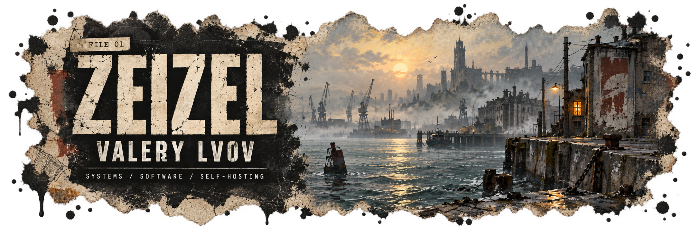
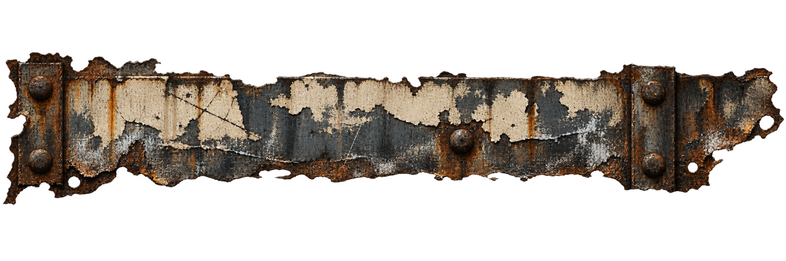

<p align="center">
  
</p>

```ts
const zeizel: Developer = {
  name: "Valery Lvov",
  role: "Full-Stack Developer",
  currentFocus: ["Management", "DevOps", "Backend Development", "System Design"],
  industry: "Retail",
  previously: "FinTech",
  askMeAbout: ["Frontend", "Desktop", "Mobile", "Backend", "DevOps"],
  funFact:
    "I am building my own work platform from different self-hosted systems " +
    "and slowly making my own game",
  hobbies: ["Post-Hardcore Music", "DnD", "Automation"],
};
```

📚 Maintaining a comprehensive [Obsidian knowledge base for IT development](https://github.com/ZeiZel/Obsidian-base).

## Tech stack

### Languages & web

<p></p>

### Frontend

<p></p>

### Backend

<p></p>

### DevOps & infrastructure

<p></p>

### Databases & messaging

<p></p>

### Tools

<p></p>

<p align="center">
  <picture>
    <source media="(prefers-color-scheme: dark)" srcset="https://raw.githubusercontent.com/ZeiZel/ZeiZel/output/breakout-contribution-graph-dark.svg" />
    <source media="(prefers-color-scheme: light)" srcset="https://raw.githubusercontent.com/ZeiZel/ZeiZel/output/breakout-contribution-graph.svg" />
    
  </picture>
</p>

<p align="center"></p>

<p align="center">
  
</p>

<sub>Visual credits: <a href="./assets/LICENSES.md">asset licenses</a> · skill icons are provided under the MIT License.</sub>
