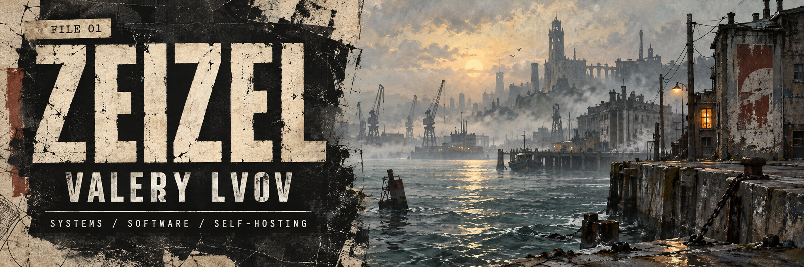

  

<strong>Full-Stack Developer · Management · DevOps · Backend · System Design</strong>

---

## 01 / DOSSIER

Full-Stack Developer focused on **Management, DevOps, Backend Development, and System Design**.

Currently working in **Retail**, previously in **FinTech**.

You can ask me about **Frontend, Desktop, Mobile, Backend, and DevOps development**.

> **VOLITION** — Keep learning. Keep shipping. Leave the system easier to understand than you found it.

---

## 02 / SKILL CABINET

### Languages & web

### Frontend

### Backend

### DevOps & infrastructure

### Databases & messaging

### Tools

**Additional databases:** Microsoft SQL Server · MariaDB · ClickHouse

**Data access:** TypeORM · Prisma ORM · GORM · PL/SQL

**Platforms & tools:** Helm · Vagrant · React Native · PWA · ESLint · Claude · Codex · Nx · Expo · Homebrew

**Observability:**

- **GPL:** Grafana · Prometheus · Loki
- **ELK:** Elasticsearch · Logstash · Kibana

---

## 03 / SIDE QUESTS

- 🛠️ **Self-hosted work platform** — assembling a personal working environment from interoperable systems.
- 🎮 **Small game** — a quiet, ongoing experiment in design, code, and atmosphere.
- 📚 **Knowledge base** — an [Obsidian vault for IT development](https://github.com/ZeiZel/Obsidian-base).

---

## 04 / AFTER HOURS

  <picture>
    <source media="(prefers-color-scheme: dark)" srcset="https://raw.githubusercontent.com/ZeiZel/ZeiZel/output/breakout-contribution-graph-dark.svg" />
    <source media="(prefers-color-scheme: light)" srcset="https://raw.githubusercontent.com/ZeiZel/ZeiZel/output/breakout-contribution-graph.svg" />
    
  </picture>

Post-Hardcore music · Dungeons & Dragons · Automation

---

## 05 / FIELD NOTES

  

Visual credits: <a href="./assets/LICENSES.md">asset licenses</a> · skill icons are provided under the MIT License.
